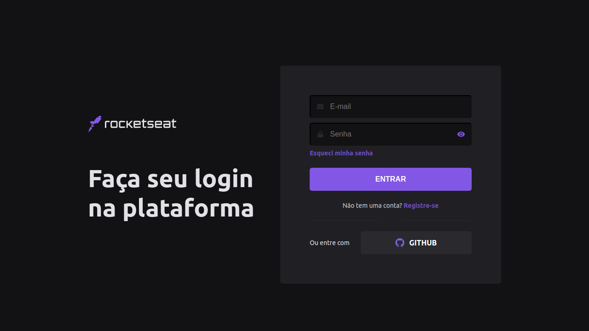

## Getting Started

First, run the development server:

```bash
npm run dev
# or
yarn dev
```
<h1 align="center">
    
    
</h1>

<br>

## :rocket: Tecnologias

Esse projeto foi desenvolvido com as seguintes tecnologias:

- [React](https://reactjs.org)
- [Next.js](https://nextjs.org/)

## 💻 Projeto

Este projeto foi desenvolvido com o intuito de conhecimento do framework Next.js.
